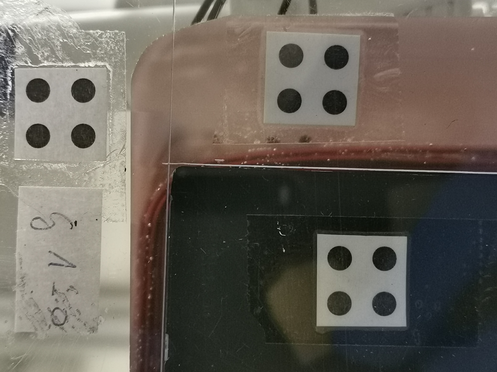
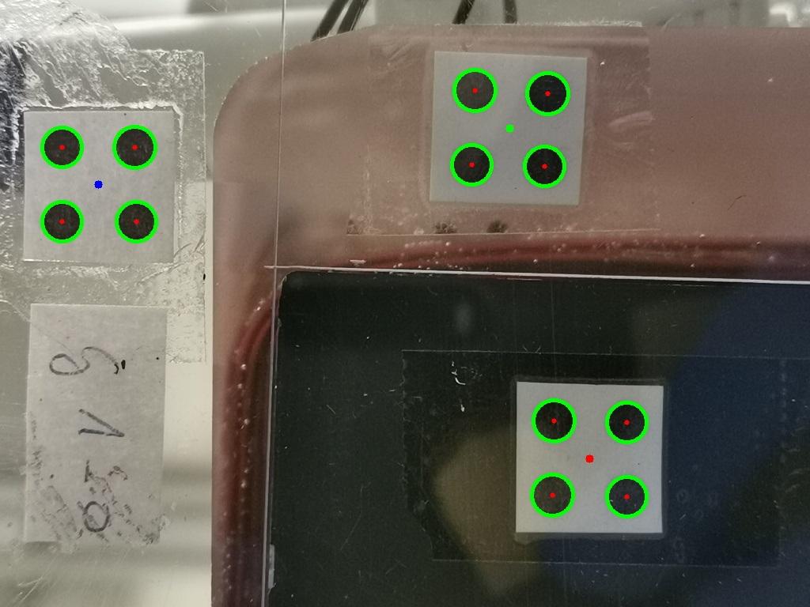
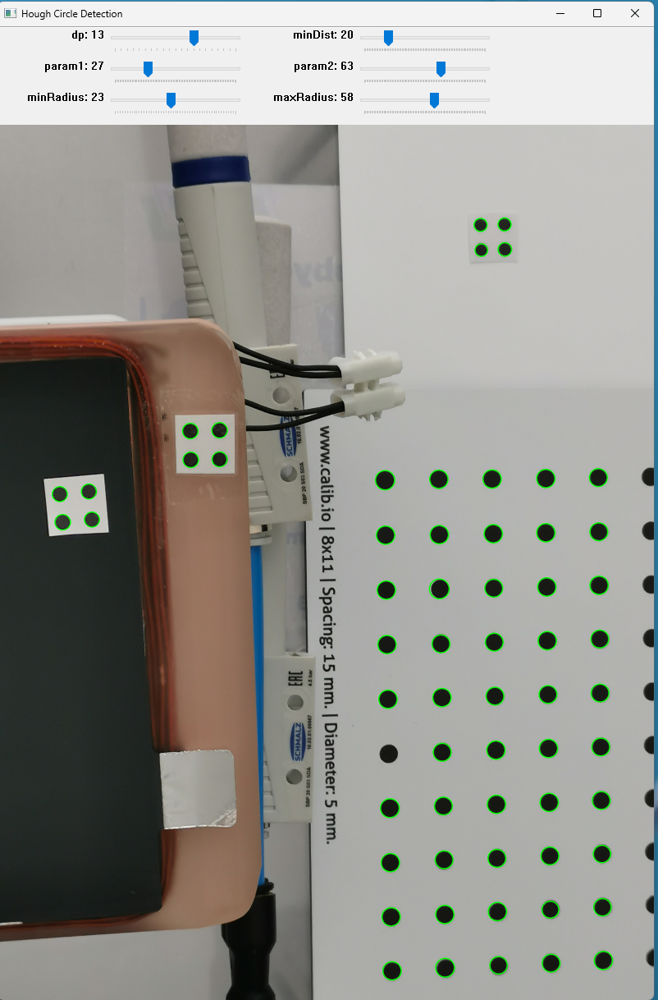

# Electrode Depositioning Accuracy Measurement Tool

## Overview

This project is designed to measure the deposition accuracy of electrodes in a robot assembly setup using computer vision techniques. The tool processes images of electrodes and reference markers to calculate the displacement between them, ensuring proper alignment during assembly. The results are compiled into an Excel file, providing detailed measurements for analysis.

## Features

- **Circle Detection:** Utilizes the Hough Circle Transform to detect markers in images.
- **Clustering with K-Means:** Groups detected markers into base and electrode groups.
- **Displacement Measurement:** Calculates the displacement between base marker and other two markers.
- **Excel Export:** Compiles the measurement data into an Excel file.
- **User-Friendly Interface:** Developed a simple GUI tool.

## Technologies Used

- **Python** 
- **OpenCV** 
- **Scikit-Learn** 
- **Pandas** 
- **Tkinter** 

## Installation

1. **Clone the repository:**
    ```bash
    git clone https://github.com/Vigneshwar-KR/Electrode-Depositioning-Accuracy-Measurement-Tool.git
    ```

2. **Install the required dependencies:**

    ```bash
    pip install -r requirements.txt
    ```

3. **Run the tool:**

    ```bash
    python main.py
    ```

## Usage

1. **Run the tool:**
   - When you run `main.py`, a window will prompt you to select the folder containing the images.
   
2. **Process the images:**
   - The tool automatically detects the markers in each image, measures the displacements and exports the results to an Excel file.

3. **View the results:**
   - The Excel file will be generated. 

## Example Output

The excel file is structured the following manner,


| Image File        | mid_group1_x (Base) [pixels] | mid_group1_y (Base) [pixels] | mid_group2_x [pixels] | mid_group2_y [pixels] | mid_group3_x [pixels] | mid_group3_y [pixels] | Distance Group 1-2 [pixels] | Distance Group 1-3 [pixels] | Distance Group 1-2 [mm] | Distance Group 1-3 [mm] |
|-------------------|------------------------------|------------------------------|-----------------------|-----------------------|-----------------------|-----------------------|-----------------------------|-----------------------------|--------------------------|--------------------------|
| example_image.jpg | 216                          | 230                          | 732                   | 146                   | 789                   | 600                   | 522.7                       | 682.07                      | 38.06                    | 49.66                    |


<table> <tr> <td></td> <td></td> </tr> <tr> <td align="center">Original Image</td> <td align="center">Detected Image</td> </tr> </table> 

<p align="center">  </p>
